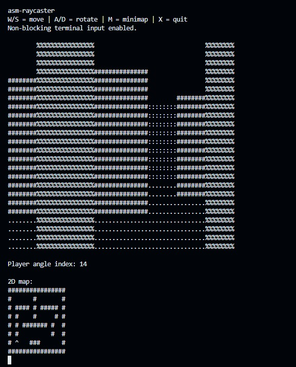

# Assembly Raycasting Engine

A Wolfenstein-style raycasting engine written in **x86-64 Assembly** for Linux.

This project was created as a low-level programming experiment to explore how early 3D-style engines rendered first-person environments using a 2D map, raycasting logic, fixed-point arithmetic, and terminal-based ASCII graphics.

## Demo

<p align="center">
  
</p>

## Features

* Written in x86-64 Assembly
* Built with NASM
* Linux syscall-based terminal output
* Fixed-point player movement
* Angled raycasting
* Distance-based wall shading
* First-person ASCII rendering
* Collision detection
* Debug minimap toggle

## Controls

| Key | Action         |
| --- | -------------- |
| W   | Move forward   |
| S   | Move backward  |
| A   | Rotate left    |
| D   | Rotate right   |
| M   | Toggle minimap |
| X   | Quit           |

## Tech Stack

* x86-64 Assembly
* NASM
* Linux
* Makefile
* ANSI terminal rendering

## Build and Run

Install dependencies:

```bash
sudo apt update
sudo apt install nasm make binutils
```

Build the project:

```bash
make
```

Run:

```bash
make run
```

Clean build files:

```bash
make clean
```

## How It Works

The engine stores the world as a 2D grid map. The player has a fixed-point position and a viewing angle. For each screen column, the program casts a ray into the map until it hits a wall. The distance to that wall determines the height of the vertical slice drawn in the terminal.

Closer walls are drawn taller and with stronger characters, while farther walls are drawn shorter and lighter.

## What I Learned

This project helped me practice:

* Assembly programming
* Linux syscalls
* Terminal rendering
* Fixed-point arithmetic
* Game loop structure
* Keyboard input handling
* Raycasting fundamentals
* Memory layout and low-level data representation

## Future Improvements

* Smoother real-time movement
* Larger maps
* Better wall shading
* Textured walls using ASCII patterns
* Sprite rendering
* Doors or interactive objects
* Improved minimap
* Demo GIF for the README
